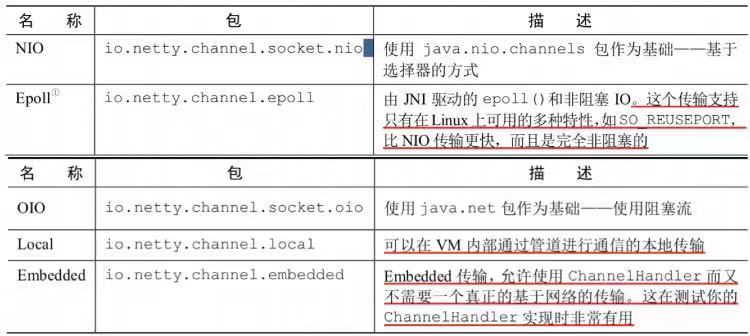
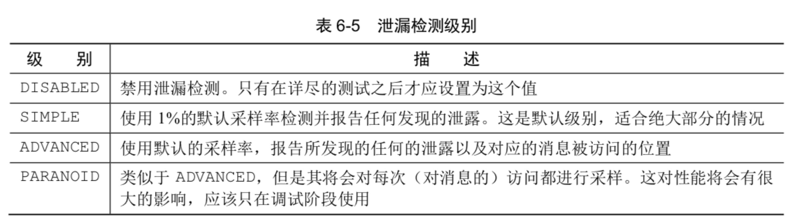

# Netty-note

## ps

- 查看pom.xml里面maven不同阶段依赖的插件
- grpc


## chapter01

### BIO区别NIO;同步区别异步

- jdk1.4引入NIO库:import java.nio.*; 
- java的BIO库:import java.io.*
- BIO阻塞IO,主要基于流实现,字节流/字符流
- NIO非阻塞IO,基于缓存和IO复用(selector),但依然是同步的;缓存解决IO阻塞,selector解决监听/IO阻塞；还有回调
- 阻塞/非阻塞主要针对IO，判断是否等待IO
- 同步/异步主要针对进程；判断是否等待子线程/子任务的结果返回

### netty的核心组件

- Channel => IO渠道的**一个抽象**
- 事件 + ChannelHandler => 实现IO**事件处理** 
- 回调 + ChannelFuture => NIO**非阻塞的实现逻辑**


```java
// -.jdk的Future 与 ChannelFuture的区别
// 1. jdk的Future 需要手动检查操作是否完成 或者 手动阻塞直到完成
// 2. ChannnelFuture 通过回调通知, 不需要手动检查或阻塞

// -.ChannelHandler的实现也是基于回调和ChannelFuture的
```

### netty 笔记&总结

- 支持的协议:http/SSL/TLS/TCP/UDP
- 选择器,事件,EventLoop的作用 => netty架构的基本理解
    - 选择器 -> 实现事件触发；主要包括Channel的接入监听、读写监听；使用 一个线程 同步 管理多个channel(达到了多线程的效果)
    - 事件   -> 事件处理基于回调和ChannelFuture; 实现了非阻塞的IO;同时加入的缓存用于处理基于流的底层传输(TCP基于流)
    - EventLoop -> netty线程池模型;一个channel分配一个EventLoop,EventLoop是对应一个Thread,处理这个Channel的所有动作,所以:channelHandler内部逻辑是同步的
- 思考BIO;NIO;AIO的区别? netty是NIO的
- 总结netty基础组件,组件解决的问题,结构设计思路
- Future的实现原理?与ChannelFuture实现的区别
- Linux的IO多路复用几种实现?
- NIO大多指传输层(TCP)的传输


## chaprer02

### ChannelPipeline(channel管道)

- 一个channel对应一个ChannelPipeline
- ChannelPipeline管理ChannelHandler的一个调用链,实现ChannelHandler调用的传递(和处理异常的传递->当前ChannelHandler没有处理的异常)

### Server/Client的实现

- 主要包括业务逻辑(ChannelHandler的实现)/引导程序(Bootstrap实现)
- 看注释
- SimpleChannelInboundHandler VS ChannelInboundHandlerAdapter 区别
    - 缓存的管理/释放的时间点
    - 所有ChannelHanlder的继承关系
- 缓存的作用 => 帮助解决基于流的传输的阻塞问题,使基于流的阻塞传输变成非阻塞的传输(基于流的传输都是阻塞的,TCP基于流)
- Channel的继承关系


## chapter03(简单的demo)

- Channel的继承关系 和 不同实现；
- EventLoop,EventLoopGroup
    - 一个Channel注册一个EventLoop
    - 一个EventLoop绑定一个Thread
    - 一个EventLoop可以分配给多个Channel
    - 一个EventLoopGroup管理多个EventLoop
    - 一个EventLoop是一个线程，处理Channel的全部时间(IO,handler),所以是同步的
- ChannelFuture
- ChannelHandler, ChannelPipeline
    - ChannelPipeline是ChannelHandler的链容器
    - Channel 映射一个ChannelPipeline，ChannelHandler的处理顺序由添加的顺序决定
    - ChannelHandler的继承关系:Inbound/Outbound
    - 两种消息发送方式的区别：写入Channel，写入ChannelHandlerContext
        - Channel 直接把消息传递给ChannelPipeline的结尾
        - ChannelHandlerContext传递消息给ChannelPipeline的下一个Handler
- 编码器/解码器(网络字节数据 <=互相转换=>应用处理数据)
    - ByteToMessageDecoder,MessageToByteEncoder
    - ProtobufEncoder,ProtobufDecoder
- Bootstrap,ServerBootstrap

### 阅读关键的源码****

## chapter04(channel,渠道抽象)

- JDK/Netty实现OIO，NIO的区别
- Channel源码,是线程安全的可以被多线程引用

```java
public interface Channel extends AttributeMap, ChannelOutboundInvoker, Comparable<Channel> {
    // 标记Channle,可比较
    ChannelId id();
    // 绑定的线程
    EventLoop eventLoop();
    Channel parent();
    // Channle的配置，可以热更新
    ChannelConfig config();
    boolean isOpen();
    boolean isRegistered();
    boolean isActive();
    ChannelMetadata metadata();
    SocketAddress localAddress();
    SocketAddress remoteAddress();
    // 异步关闭Future
    ChannelFuture closeFuture();
    boolean isWritable();
    long bytesBeforeUnwritable();
    long bytesBeforeWritable();
    Channel.Unsafe unsafe();

    //管理ChannelHandler
    ChannelPipeline pipeline();
    // 缓存分配类，默认返回池化的缓存分配:PooledByteBufAllocator
    ByteBufAllocator alloc();
    Channel read();
    Channel flush();

    public interface Unsafe {
        Handle recvBufAllocHandle();
        SocketAddress localAddress();
        SocketAddress remoteAddress();
        void register(EventLoop var1, ChannelPromise var2);
        void bind(SocketAddress var1, ChannelPromise var2);
        void connect(SocketAddress var1, SocketAddress var2, ChannelPromise var3);
        void disconnect(ChannelPromise var1);
        void close(ChannelPromise var1);
        void closeForcibly();
        void deregister(ChannelPromise var1);
        void beginRead();
        void write(Object var1, ChannelPromise var2);
        void flush();
        ChannelPromise voidPromise();
        ChannelOutboundBuffer outboundBuffer();
    }
}

```

- Netty支持的传输



    - Local:同一个JVM内部传输 => 实现消息异步??
    - Embeded: 单元测试使用
    
- socket注册Selector的事件

```
public static final int OP_READ = 1 << 0;
public static final int OP_WRITE = 1 << 2;
public static final int OP_CONNECT = 1 << 3;
public static final int OP_ACCEPT = 1 << 4;
```
- 零拷贝(zero-copy)
    - 支持nio,epool传输
    - 实现文件系统->网络接口拷贝，不需要经过内核空间到用户空间的复制(查看源码实现原理)
- 对linux的Epoll的支持 => (EpollEventLoopGroup,EpollServerSocketChannel.class)

## chapter05(字节缓存:ByteBuf)

- JDK的NIO提供ByteBuffer,Netty提供ByteBuf, => 对比ByteBuf的优势
- ByteBuf,ByteBufHolder(源码)
- 缓冲区类型
    - 堆缓存，直接缓存，复合缓存
    - 池化缓存 vs 非池化缓存的区别(池化缓存只在需要时释放,非池化每次需要快速的分配和释放,使用jemalloc分配)
- ByteBufHolder
- ByteBufAllocator
- Unpooled
- ByteBufUtil

## chapter06


## 实战案例

- Channel生命周期
    - unregistered,registered,active,inactive(每个周期有不同的回调接口)
- ChanelHandler生命周期
    - handleAdded,handlerRemoved,execptionCaught(周期)
- ChanelPromise（完成异步通知,源码),ChannelFuture
- 内存捡漏的级别


```java设置级别
java -Dio.netty.leakDetectionLevel=ADVANCED 
```
- ChannelHandlerContext
- ChannelPipeline的上Handler处理的顺序
- 异常处理

## chapter07(EventLoop,线程模型)

### jdk 线程池模型 ThreadPoolExecutor

```java 

// 线程的状态 => 解释不明确
private static final int RUNNING    = -1 << COUNT_BITS;
private static final int SHUTDOWN   =  0 << COUNT_BITS;  
private static final int STOP       =  1 << COUNT_BITS;
private static final int TIDYING    =  2 << COUNT_BITS;  // 无任务,线程池空闲
private static final int TERMINATED =  3 << COUNT_BITS;

```

- 主要解决线程池创建和销毁的开销，不会改变线程池上下文切换的开销

###  Netty线程池模型

- 事件循环模型 => 解析不清楚(EventLoop源码)
    - 一个channel绑定一个Eventloop,一个EventLoop可以被多个Channel绑定，在Channe的全部生命周期，都使用同一个EventLoop
    - Channel提交的任务到指定的EventLoop的任务队列,在EventLoop的线程中FIFO循环处理,任务是同步的(不要加入延时任务)
    - EventLoop的任务队列是jdk线程池模型的,
    - 每个EventLoop由一个Thread支撑

- 如图
    
- netty4,netty3的区别EventLoop,处理IO/事件
    - netty4在分配的EeventLoop中处理全部的IO,handler
    - netty3?
- EventLoopGroup线程池模型
   - NIO
   - OIO

## chapter08 (Bootstrap,引导类)

- Bootstrap,ServerBootstrap的源码,以及区别
    - clone()浅拷贝实现EventLoopGroup的复用
- EventLoop的共享复用的实现(代理服务器)
- ChannelInitializer的源码实现
- ChannelOption事关性能的配置,属性传递
- 优雅关机=> 释放额外的线程

## chapter09(EmbeddedChannel,单元测试)
## chapter10(编码/解码)
## chapter11(预制的类)
## chapter12(websocket)
## chapter13(UDP)